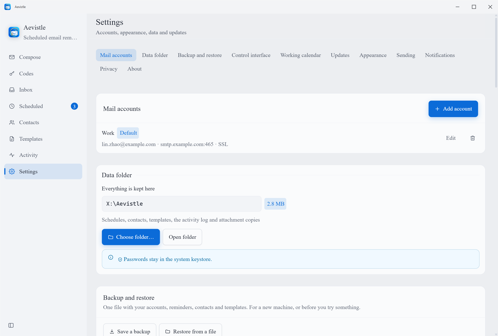

<div align="center">


# Aevistle

**Des rappels par e-mail programmés qui arrivent vraiment.**

Rédigez un e-mail une fois — fichiers, images ou archives en pièce jointe — et
Aevistle l’envoie à l’heure dite, même fenêtre fermée. Une seule fois, chaque
jour ouvré à 09:00, le 1er du mois, ou selon n’importe quelle expression cron.
Il connaît vos jours fériés : le rapport du lundi ne part pas un lundi où
personne ne travaille.
Windows et Android, sans compte, sans serveur, sans télémétrie. Deux appareils
restent synchronisés par votre propre réseau — aucun nuage au milieu.

*Le rapport hebdomadaire du vendredi. La facture du 1er. Le message
d’anniversaire à minuit, pendant que vous dormez.*

[](https://github.com/Aevorine/Aevistle/releases/latest)
[](https://github.com/Aevorine/Aevistle/actions/workflows/ci.yml)
[](../LICENSE)
[](https://github.com/Aevorine/Aevistle/releases/latest)
[](https://github.com/Aevorine/Aevistle/releases/latest)
[](#language)

### [⬇ Télécharger](https://github.com/Aevorine/Aevistle/releases/latest) · [Ce qu’il fait](#ce-quil-fait) · [Confidentialité](#confidentialité) · [Sécurité](#sécurité)

[English](../README.md) ·
[简体中文](README.zh-CN.md) ·
**Français** ·
[Español](README.es.md) ·
[Русский](README.ru.md) ·
[العربية](README.ar.md)

</div>

---

<div align="center">

</div>

---

## Pourquoi ce logiciel existe

N’importe quel client de messagerie sait envoyer un e-mail. Presque aucun ne
sait vous promettre qu’il partira mardi prochain à 07:00 avec la bonne pièce
jointe — que vous y pensiez ou non, que l’application soit ouverte ou non.

Aevistle tient d’abord cette promesse-là. Aucun compte à créer — il se connecte
au serveur SMTP que vous avez déjà (Gmail, Outlook, QQ, 163, le serveur de
votre entreprise) et envoie. La réception existe aussi, mais elle reste en
retrait tant que vous ne l’activez pas : pointez un compte vers son serveur
IMAP, et Aevistle rapatrie une boîte de réception unifiée, extrait
automatiquement les codes de vérification et les liens de connexion, et laisse
tout le reste tranquille par défaut.

**On s’en sert pour** envoyer un rapport hebdomadaire chaque vendredi à 17:00 · rappeler un devoir à une classe la veille · expédier une facture le 1er de chaque mois · poster un message d’anniversaire à minuit en dormant · relancer un loyer tous les 30 jours · programmer une relance qui arrive le matin plutôt qu’à 02:00 · récupérer un code de connexion dès son arrivée sans changer d’application.

**Ce n’est sans doute pas pour vous si** vous cherchez un client de messagerie complet — pas de gestion de dossiers, pas de synchronisation push IDLE, pas de suppression côté serveur, volontairement — un outil marketing avec pixels de suivi et taux d’ouverture, ou un service hébergé qui continue d’envoyer alors que vos appareils sont éteints. Aevistle envoie et lit depuis *votre* machine avec *votre* boîte — c’est précisément pourquoi il n’a besoin d’aucun compte qui lui soit propre et ne collecte rien.

## Confidentialité

Aevistle n’a aucun serveur. Aucun compte à créer, aucune télémétrie, aucun
rapport de plantage.

Une liste courte et fixe de choses quittent votre appareil, et rien d’autre :
**la connexion SMTP vers votre propre fournisseur** ; **la connexion IMAP vers
ce même fournisseur**, uniquement pour les comptes où vous avez activé la
réception ; **une image distante dans un message reçu**, seulement quand vous
demandez celle-là explicitement ; **une vérification de mise à jour** auprès de
`api.github.com`, si vous la laissez active ; et **les jours fériés d’une
année**, seulement quand vous appuyez sur « vérifier en ligne ». Les deux
dernières sont sur liste blanche par hôte *et* par chemin exact, et partent du
processus de confiance, non de la partie de l’application qui affiche le
courrier — laquelle n’a aucun accès réseau sortant.

Appairer deux appareils n’ajoute rien à cette liste : ils se parlent
directement sur votre propre réseau, sans nuage et sans relais au milieu.

> Mises à jour désactivées, chaque requête qui reste dans cette liste est une
> requête pour laquelle vous avez appuyé sur un bouton.

Où chaque chose est rangée, ce que déplacer le dossier de données fait
réellement, et les deux choses qui restent volontairement en arrière →
**[PRIVACY.md](PRIVACY.md)**.

## Ce qu’il fait

| | |
|---|---|
| ⏰ **Se déclenche fenêtre fermée** | Un processus dans la zone de notification sous Windows, une alarme exacte plus WorkManager sous Android. Fermer la fenêtre n’annule rien. [→](FEATURES.md#fires-when-closed) |
| 🔁 **Une vraie récurrence** | Une fois, toutes les N minutes, quotidienne, hebdomadaire, mensuelle, annuelle, ou une expression cron complète à 5 champs. [→](FEATURES.md#real-recurrence) |
| 📎 **Des pièces jointes qui survivent à l’attente** | Les fichiers sont copiés au moment où vous programmez : déplacer ou renommer l’original ne casse rien en silence. [→](FEATURES.md#attachment-snapshots) |
| 🎌 **Calendriers de travail** | Jours fériés, week-ends de votre choix, jours de rattrapage 调休, six pays en un clic, `.ics` dans les deux sens. Chaque rappel y adhère ou non. [→](FEATURES.md#working-days-you-define) |
| 🌐 **Fenêtres de remise** | Un rappel tombe dans la journée du *destinataire*, pas dans la vôtre — et rien n’est jamais retenu : un réglage impossible est signalé, pas subi. [→](FEATURES.md#delivery-windows) |
| 📆 **La grille du mois, c’est le planning** | Glisser pour déplacer, cliquer pour ouvrir, teinté selon la charge du jour — avec destinataires, aperçu du corps et état de remise. [→](FEATURES.md#the-month-grid-is-the-schedule) |
| 📥 **Boîte de réception optionnelle** | IMAP, unifiée entre les comptes, images distantes bloquées par défaut, codes de vérification sur un écran à eux. [→](FEATURES.md#optional-inbox) |
| 🔤 **Variables de fusion** | Champs de contact par destinataire et variables de calendrier comme `{{nextWorkday}}`, résolues à l’envoi, Cc et Cci retirés des copies. [→](FEATURES.md#merge-variables) |
| 🔐 **Les mots de passe restent chez vous** | Chiffrés par le système : DPAPI sous Windows, Keystore matériel sous Android. Jamais dans les réglages, jamais dans un export. [→](FEATURES.md#passwords-stay-put) |
| 🎨 **Sept styles visuels** | Chacun avec une vraie déclinaison claire et une vraie sombre, dont un WCAG AAA de bout en bout et non à peu près. [→](FEATURES.md#seven-visual-styles) |

Trente-six entrées comme celles-ci, chacune avec le raisonnement derrière →
**[FEATURES.md](FEATURES.md)**

## Nouveautés de la 0.1.16

Réparations de la mise en page mobile introduite par la 0.1.15 — aucune
fonctionnalité n'a changé, et rien de la façon dont le courrier est planifié,
envoyé, stocké ou chiffré n'a été touché.

- **Les dialogues sont l'écran, pas une carte flottant dessus.** Une section des
  réglages s'ouvrait avec une gouttière tout autour et la barre d'onglets
  visible en dessous. Les dialogues de contenu occupent maintenant tout l'écran
  et se ferment par le bouton de leur en-tête ; les courtes confirmations
  restent délibérément des cartes.
- **Les écrans ouverts depuis Accueil avaient perdu leur bouton principal.**
  Masquer un titre en double masquait aussi l'élément qui porte la commande
  principale de chaque écran : Contacts n'offrait plus aucun moyen d'ajouter un
  contact. Seul le texte du titre disparaît désormais.
- **Les réglages ont cessé de se répéter** — le sous-titre épinglé qui résumait
  les lignes juste en dessous, et chaque section se nommant deux fois.

Mesuré sur la fenêtre en cours d'exécution plutôt que déduit : les trois
dialogues de contenu rapportent chacun `(0, 0, 390, 800)` dans une fenêtre
`390×800`, la confirmation `350×254` avec des gouttières symétriques.

## Nouveautés de la 0.1.15

- **📲 Android se met à jour tout seul.** La vérification a toujours fonctionné ;
  le téléchargement et l'installation étaient réservés au bureau, si bien que le
  téléphone pouvait annoncer une nouvelle version puis ne proposer qu'un lien
  vers une page web. Il récupère désormais l'APK dans l'application, avec une
  barre de progression, vérifié contre le `SHA256SUMS` publié avec la version,
  puis le confie à l'installateur du système — qui vous demande toujours de
  confirmer. Le fichier est écrit dans le stockage privé de l'application, pas
  dans un dossier Téléchargements partagé.
- **🏠 Un onglet Accueil, et une barre du bas qui tient.** Neuf onglets n'ont
  jamais tenu sur un écran de 360 px ; la barre était devenue un défilement
  horizontal avec quatre d'entre eux hors écran. Ils sont cinq désormais —
  Rédiger, Codes, Accueil, Boîte de réception, Réglages — avec les
  planifications, les contacts, les modèles, le calendrier de travail et le
  journal d'envoi derrière Accueil. La barre latérale du bureau en liste
  toujours neuf, et `Ctrl+1`–`Ctrl+9` atteignent toujours les neuf des deux
  côtés.
- **⚙️ Les réglages sont une liste, pas quatorze écrans de défilement.** Seize
  sections en une colonne : atteindre Confidentialité imposait de défiler devant
  toutes les autres. Sur téléphone, ce sont maintenant seize lignes qui
  s'ouvrent une à la fois ; le bureau garde sa grille à deux colonnes. Les
  textes explicatifs sous les interrupteurs s'effacent sur téléphone — jamais
  les avertissements ni les erreurs.
- **📡 L'appairage compose la bonne carte réseau.** Il publiait la première
  adresse listée par le système, ce qui, sur une machine avec un VPN, un
  hyperviseur ou un moteur de conteneurs, était régulièrement un adaptateur
  virtuel qu'aucun téléphone ne peut joindre — quatre secondes d'attente sur
  l'autre appareil et pas le moindre indice. Les adresses sont maintenant
  classées, celle retenue est affichée à côté du QR code, et une machine
  multi-réseaux obtient un sélecteur.

Également corrigé : les interrupteurs dont le bouton ne bougeait jamais sur les
anciennes versions d'Android System WebView, et une entrée « lancer au
démarrage » qu'une exécution depuis les sources pouvait laisser pointée sur la
fenêtre d'exemple d'Electron.

## Nouveautés de la 0.1.14

- **🔗 Appairer deux appareils par votre réseau local, et rien d’autre.** Scannez
  un QR code sur l’autre appareil : ECDH P-256 + AES-GCM, un jeton à usage
  unique qui expire au bout de deux minutes, aucun nuage et aucun serveur relais
  à aucun moment. Vous choisissez ce qui se synchronise — comptes, planning,
  contacts, modèles, apparence — et gérez les appareils appairés depuis un seul
  écran. Deux appareils qui ne se voient pas échangent un fichier chiffré par
  code PIN à la place.
- **📅 Le calendrier connaît le courrier.** Destinataires et nombre d’envois par
  jour, carte de densité, aperçu du corps sans quitter la grille, l’heure locale
  du destinataire affichée *pendant* que vous déplacez un envoi, une proposition
  de report quand un envoi tombe un jour férié, des actions groupées sur toute
  une série récurrente, un filtre par compte ou par destinataire, des pastilles
  d’état de remise, et une adresse d’abonnement `.ics` locale pour le calendrier
  de travail.
- **🎨 Un nouveau style visuel : runecircuit.** L’encre classique chinoise
  rencontre le néon cyberpunk, avec une forme de jour et une forme de nuit, un
  réglage d’intensité d’atmosphère et un sélecteur d’accent à deux axes. Le
  septième style, et le premier à avoir un climat.
- **🌾 Les 24 termes solaires (节气), calculés plutôt que consultés.** La position
  solaire de Meeus, et non une table embarquée — il n’y a donc aucune année où
  la couverture s’arrête. Cela teinte le calendrier ; cela ne touche jamais une
  heure d’envoi.

Détaillé dans **[FEATURES.md](FEATURES.md)** ; ce qui a changé avant se trouve
dans les fichiers `release-notes-0.1.*.md` à la racine du dépôt.

## Téléchargement

La dernière version se trouve dans **[Releases](https://github.com/Aevorine/Aevistle/releases/latest)**.

| Plateforme | Fichier | Remarques |
|---|---|---|
| Windows 10/11 (x64) | `Aevistle-<version>-win-x64-setup.exe` | Programme d’installation, avec raccourcis menu Démarrer et bureau |
| Windows 10/11 (x64) | `Aevistle-<version>-win-x64-portable.exe` | Fichier unique, sans installation, fonctionne depuis une clé USB |
| Android 7.0+ | `Aevistle-<version>.apk` | Téléphones et tablettes. Autorisez d’abord « installer des applications inconnues » pour votre navigateur ou gestionnaire de fichiers. |

`<version>` est le numéro affiché sur la page de la
[dernière version](https://github.com/Aevorine/Aevistle/releases/latest) — le
badge en haut de cette page le lit au même endroit. Volontairement pas écrit en
dur ici, pour que ce tableau ne puisse pas se périmer.

> **Vérifier un téléchargement.** Chaque version publie `SHA256SUMS.txt`, une
> signature détachée `SHA256SUMS.txt.asc` et la clé publique correspondante :
>
> ```bash
> gpg --import aevistle-public-key.asc
> gpg --verify SHA256SUMS.txt.asc SHA256SUMS.txt
> sha256sum -c SHA256SUMS.txt
> ```
>
> Les sommes de contrôle prouvent que le fichier est arrivé intact ; la
> signature prouve qu’il vient de la clé de ce projet. L’empreinte se trouve
> dans [SECURITY.md](../SECURITY.md).

> Windows SmartScreen signalera un éditeur inconnu. C’est l’aspect normal d’une
> version sans certificat de signature payant : choisissez **Informations
> complémentaires → Exécuter quand même**, ou vérifiez d’abord l’empreinte
> SHA-256 depuis la page de la version.

## Premiers pas

1. **Ajoutez votre boîte mail.** Réglages → Ajouter un compte. Choisissez votre
   fournisseur : serveur, port et chiffrement sont remplis pour vous.
2. **Créez un mot de passe d’application.** Gmail, Outlook, Yahoo, iCloud, QQ et
   163 refusent tous votre mot de passe habituel depuis une application tierce.
   La boîte de dialogue renvoie directement vers la page de création.
3. **Testez la connexion.** Un bouton. Il s’authentifie sans rien envoyer : vous
   le savez maintenant plutôt qu’à 03:00.
4. **Écrivez votre rappel**, joignez ce qu’il faut, puis choisissez **Planifier**.

<div align="center">

</div>

Pour que les envois programmés partent fenêtre fermée, laissez
*Garder actif dans la zone de notification* activé (Windows) et autorisez les
alarmes exactes et les notifications quand Android le demande.

## Sécurité

Le modèle de menace, les choix de durcissement et la procédure de signalement
sont dans **[SECURITY.md](../SECURITY.md)**.

En bref : le rendu s’exécute sans accès Node, avec isolation de contexte et une
CSP stricte ; toute chaîne destinée à un en-tête de courrier est rejetée si elle
contient un saut de ligne (c’est ainsi que naissent les relais ouverts) ; les
certificats TLS sont vérifiés sauf désactivation explicite par compte ; le HTML
d’un message reçu est assaini dans le processus principal selon une liste
stricte avant même d’atteindre le rendu, puis affiché dans un iframe en bac à
sable sans aucune exécution de script possible ; et le récepteur d’alarme
Android n’est pas exporté, donc aucune autre application ne peut faire envoyer
un courrier par Aevistle.

Vous pouvez tout vérifier vous-même avec `npm run audit:self` — **21 contrôles**,
sortie en langage clair, code de sortie 1 si quelque chose cloche.

## Compiler depuis les sources

**Prérequis** — Node.js 20+, et pour Android : JDK 17+, Android SDK
(plateforme 36, build-tools 35+). `npm run build:android` détecte un JDK et un
SDK installés mais absents du `PATH`, donc `JAVA_HOME` est facultatif.

```bash
git clone https://github.com/Aevorine/Aevistle.git
cd Aevistle
npm install
```

| Tâche | Commande |
|---|---|
| Lancer dans un navigateur (sans SMTP, tout le reste réel) | `npm run dev` |
| Vérification de types | `npm run typecheck` |
| Audit de sécurité (21 contrôles) | `npm run audit:self` |
| Tout ce que la CI exécute (42 contrôles) | `npm run check` |
| Lancer l’application de bureau | `npm start` |
| Construire les installeurs Windows | `npm run dist:win` |
| Construire l’APK Android | `npm run build:android` |

La signature de publication Android lit `~/.aevistle/keystore.properties` ou les
variables `AEVISTLE_KEYSTORE*`. Sans l’un ni l’autre, la compilation retombe sur
la clé de débogage : l’APK reste installable.

## Architecture

Une interface React + TypeScript, deux enveloppes natives.

```
src/core/        indépendant de la plateforme : modèle, moteur de récurrence,
                 validation, préréglages SMTP — ni DOM, ni Node, ni Android
src/             l’interface React (six langues, sept styles visuels, chacun
                 avec une vraie déclinaison claire et une vraie sombre)
    ↓ PlatformBridge — l’unique jointure entre l’UI et un système
electron/        Windows : nodemailer + imapflow, secrets DPAPI, zone de
                 notification, planificateur hybride tick/précis, assainissement
                 HTML pour le courrier reçu
android/         Android : JavaMail (envoi + réception), Keystore, AlarmManager + WorkManager
```

Le moteur de récurrence vit délibérément en TypeScript seulement. Il précalcule
une liste d’horodatages absolus, et le planificateur de chaque plateforme se
contente de répondre « réveille-moi à T » — toutes les règles de calendrier
(années bissextiles, mois courts, heure d’été, week-ends) existent donc une
seule fois, dans un seul langage, et se testent sans émulateur.

Plus de détails dans **[ARCHITECTURE.md](ARCHITECTURE.md)**.

## Feuille de route

Pas des promesses — ce qui viendra le plus probablement ensuite.

- [ ] OAuth 2.0 pour Gmail et Microsoft 365, pour ne plus avoir besoin de mots
      de passe d’application
- [ ] Un éditeur de texte enrichi. Les images intégrées fonctionnent déjà ; la
      zone de saisie, elle, reste du texte brut avec du Markdown
- [ ] Versions bureau macOS et Linux (le code les vise déjà)
- [ ] `FEATURES.md` dans les cinq autres langues
- [ ] iOS

Il manque quelque chose ? [Ouvrez un ticket](https://github.com/Aevorine/Aevistle/issues) —
les demandes de fonctionnalités sont les bienvenues.

## Contribuer

Les pull requests sont bienvenues. Voir **[CONTRIBUTING.md](../CONTRIBUTING.md)**
pour l’organisation du code et ce à quoi ressemble une bonne contribution, et
**[CODE_OF_CONDUCT.md](../CODE_OF_CONDUCT.md)** pour la façon dont on est censé
se traiter ici. Ajouter une septième langue tient dans un fichier et ne demande
aucun outillage : le système de types indique exactement quelles chaînes
manquent.

Les rapports de bogue et les demandes de fonctionnalité ont des
[modèles](https://github.com/Aevorine/Aevistle/issues/new/choose) ; chaque pull
request passe le même `npm run check` que vous lanceriez en local.

## Language

| | | |
|---|---|---|
| [English](../README.md) | [简体中文](README.zh-CN.md) | [Français](README.fr.md) |
| [Español](README.es.md) | [Русский](README.ru.md) | [العربية](README.ar.md) |

## Licence

[MIT](../LICENSE) © Aevistle contributors
