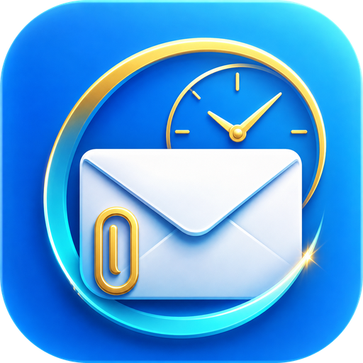
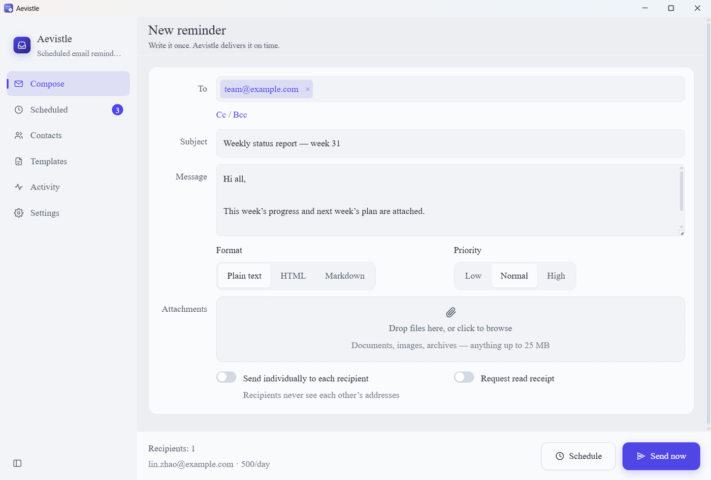

<div align="center">



# Aevistle

**Отложенные письма-напоминания, которые действительно доходят.**

Напишите письмо один раз — с файлами, изображениями или архивами во вложении —
и Aevistle отправит его вовремя. Один раз, каждый будний день в 09:00, первого
числа месяца или по любому выражению cron. Одно и то же приложение на Windows
и Android.

[](https://github.com/Aevorine/Aevistle/releases/latest)
[](../LICENSE)
[](https://github.com/Aevorine/Aevistle/releases/latest)
[](https://github.com/Aevorine/Aevistle/releases/latest)

[English](../README.md) ·
[简体中文](README.zh-CN.md) ·
[Français](README.fr.md) ·
[Español](README.es.md) ·
**Русский** ·
[العربية](README.ar.md)

</div>

---

<div align="center">

</div>

---

## Зачем это нужно

Отправить письмо умеет любой почтовый клиент. Почти никто не может пообещать,
что оно уйдёт в следующий вторник в 07:00 с нужным вложением — независимо от
того, вспомните вы об этом или нет и открыто ли приложение.

Aevistle прежде всего выполняет именно это обещание. Учётная запись не нужна —
он подключается к вашему SMTP-серверу (Gmail, Outlook, QQ, 163,
корпоративному) и отправляет. Приём тоже есть, но он не мешается, пока вы сами
его не включите: укажите для учётной записи IMAP-сервер, и Aevistle соберёт
единый почтовый ящик, автоматически выделит коды подтверждения и ссылки для
входа, а всё остальное по умолчанию оставит как есть.

**Его берут, чтобы** отправлять недельный отчёт каждую пятницу в 17:00 · напоминать классу о домашнем задании накануне · выставлять счёт первого числа каждого месяца · поздравить с днём рождения ровно в полночь, пока вы спите · напоминать об арендной плате каждые 30 дней · запланировать письмо так, чтобы оно пришло утром, а не в два часа ночи · получить код входа сразу по прибытии, не переключаясь между приложениями.

**Скорее всего, это не для вас, если** нужен полноценный почтовый клиент — без управления папками, без push-синхронизации IDLE, без удаления на сервере, и это намеренно, — маркетинговый инструмент с пикселями отслеживания и статистикой открытий или облачный сервис, который продолжает рассылку при выключенных устройствах. Aevistle отправляет и читает с *вашей* машины через *ваш* ящик — именно поэтому ему не нужна собственная учётная запись и он ничего не собирает.

## Что он умеет

| | |
|---|---|
| 📮 **Отправить сейчас или позже** | Две главные кнопки закреплены внизу экрана составления при любом размере окна. Прокручивать ради отправки не приходится. |
| 📥 **Приём почты по желанию** | Включите IMAP для учётной записи — Aevistle сам подставит сервер, проверит его до сохранения и соберёт единый почтовый ящик из всех учётных записей: общим списком или с фильтром по одной, с выбранным вами интервалом проверки. Открытое письмо занимает всё окно; `Esc` возвращает назад. `J`/`K` переключают письма, `Ctrl+F` ищет внутри. Полученные вложения просматриваются на месте — изображения, PDF и текст — либо открываются системной программой, сохраняются куда угодно или показываются в файловом менеджере. Внешние изображения по-прежнему блокируются, а каждая ссылка открывается через подтверждение с настоящим адресом. |
| 🔑 **Коды подтверждения — на отдельном экране** | Коды и ссылки для входа автоматически извлекаются из приходящей почты и собираются на собственном экране: отправитель, тема, время получения и сам код — крупно, чтобы прочитать с одного взгляда. Нажатие в любом месте карточки копирует его. Уведомление приносит код с собой, так что открывать ничего не нужно, а история переживает удаление исходного письма. |
| ⚡ **Пакетная отправка** | Одно запланированное срабатывание может отправить одно и то же сообщение несколько раз подряд с интервалом в миллисекундах, который вы задаёте, — чтобы нагрузочно тестировать собственный канал отправки, а не рассылать спам. |
| 📎 **Любые вложения и картинки в теле письма** | Документы, изображения, архивы — всё, что укладывается в лимит провайдера. Вставьте скопированное изображение прямо в текст письма — оно появится встроенным; любое вложенное изображение также можно превратить из вложения в картинку внутри письма и обратно. Aevistle показывает реальный размер при отправке: base64 превращает файл на 20 МБ в 27 МБ — именно поэтому вложения «в пределах лимита» отбиваются. |
| 🔁 **Настоящая периодичность** | Один раз · каждые N минут · ежедневно · еженедельно по выбранным дням · ежемесячно (с разумным правилом для 31-го) · ежегодно · полный cron из 5 полей. |
| 🔒 **Снимки вложений** | Запланируйте напоминание на следующий месяц — Aevistle хранит собственную копию файлов, так что перемещение или переименование оригиналов ничего молча не сломает. |
| ⏰ **Срабатывает при закрытом окне** | В Windows остаётся процесс в области уведомлений; в Android — точный будильник плюс WorkManager. Закрытие окна не отменяет напоминания. |
| 🌙 **Политика догона** | Ноутбук спал и пропустил три момента отправки? Выберите одну догоняющую отправку или пропуск. Три одинаковых письма утром вам не придут. |
| 🎲 **Разброс и выходные** | Разнесите отправки внутри окна, чтобы провайдер не принял всплеск за спам, и перенесите выходные срабатывания на понедельник. |
| 🔐 **Пароли остаются на месте** | Шифруются системой: DPAPI в Windows, аппаратное хранилище ключей в Android. Никогда не попадают ни в файл настроек, ни в экспорт. |
| 📂 **Ваша папка — ваши правила** | При первом запуске Aevistle спрашивает, где хранить данные, а **Настройки → Папка данных** позволяют изменить это позже. Он перенесёт то, что уже есть, **и исправит пути внутри существующих расписаний** — напоминание, созданное месяц назад, всё так же найдёт своё вложение. |
| 🔌 **Соединения, которые срабатывают** | Порт и шифрование не совпали? Aevistle попробует другое сочетание, которое принимает ваш провайдер, вместо отказа с «Unexpected socket close», а затем предложит сохранить то, что сработало. У каждой попытки есть предел времени, поэтому кнопка проверки всегда возвращает ответ. |
| 🩺 **Говорит, что произошло** | Успешная проверка показывает выбранную точку подключения и время отклика; неудачная называет причину и что изменить. На экране журнала есть доля успешных отправок и медианное время. |
| 🌙 **Тихие часы** | Ночные напоминания ждут утра. Ручная отправка никогда не задерживается — вы же за компьютером. |
| ⬆️ **Обновления внутри приложения** | Запрашивает GitHub Releases, скачивает установщик, сверяет его с опубликованным SHA-256 и передаёт системе. На Android APK открывается системным установщиком. Можно отключить; кроме самого запроса ничего не отправляется. |
| 🌍 **Шесть языков** | English, 简体中文, Français, Español, Русский, العربية — с полноценной раскладкой справа налево для арабского. |
| 🎨 **Приятно смотреть** | Светлая и тёмная темы, по системе или зафиксированные, шесть акцентных цветов, две плотности и подбор шрифта по письменности: Songti (宋体) для китайского, Times New Roman для латиницы и пунктуации. |

## Загрузка

Свежая сборка — в разделе **[Releases](https://github.com/Aevorine/Aevistle/releases/latest)**.

| Платформа | Файл | Примечания |
|---|---|---|
| Windows 10/11 (x64) | `Aevistle-0.1.0-win-x64-setup.exe` | Установщик, создаёт ярлыки в меню «Пуск» и на рабочем столе |
| Windows 10/11 (x64) | `Aevistle-0.1.0-win-x64-portable.exe` | Один файл, без установки, работает с флешки |
| Android 7.0+ | `Aevistle-0.1.0.apk` | Телефоны и планшеты. Сначала разрешите «установку неизвестных приложений» для браузера или файлового менеджера. |

> Windows SmartScreen предупредит о неизвестном издателе. Так выглядит сборка
> без платного сертификата подписи кода: выберите **Подробнее → Выполнить в
> любом случае** или сначала сверьте SHA-256 со страницей релиза.

## Быстрый старт

1. **Добавьте почтовый ящик.** Настройки → Добавить учётную запись. Выберите
   провайдера — сервер, порт и шифрование заполнятся сами.
2. **Получите пароль приложения.** Gmail, Outlook, Yahoo, iCloud, QQ и 163 не
   принимают обычный пароль от сторонних программ. В диалоге есть прямая ссылка
   на страницу создания.
3. **Проверьте подключение.** Одна кнопка. Авторизация без отправки письма —
   узнаете о проблеме сейчас, а не в 03:00.
4. **Напишите напоминание**, приложите нужное и нажмите **Запланировать**.

Чтобы отправка срабатывала при закрытом окне, оставьте включённым
*Оставаться в области уведомлений* (Windows) и разрешите точные будильники и
уведомления, когда их запросит Android.

## Приватность

У Aevistle нет сервера. Не нужно заводить учётную запись, нет телеметрии и нет
отчётов о сбоях.

Короткий фиксированный список того, что вообще покидает ваше устройство, и
больше ничего:

1. **SMTP-соединение с вашим почтовым провайдером** — ваше сообщение, до
   почтового ящика, который вы настроили.
2. **IMAP-соединение с вашим почтовым провайдером** — только для учётных
   записей, где вы включили приём, и только чтобы забрать почту этой записи.
3. **Внешнее изображение внутри полученного письма, только когда вы явно
   просите его загрузить** — по умолчанию каждое изображение заблокировано и
   заменено заглушкой, потому что удалённый `` — старейший приём слежки
   в электронной почте. Сама загрузка защищена от перенаправления на вашу
   собственную сеть (никаких внутренних IP, никакого следования редиректам).
4. **Проверка обновлений**, если вы её не отключили: неаутентифицированный
   `GET` к `api.github.com` с вопросом о последней версии. Не несёт ни данных
   учётной записи, ни содержимого писем, ни статистики использования.
   Отключите её в **Настройки → Обновления**, и приложение вовсе перестанет
   делать собственные запросы.

Всё хранится на вашем устройстве:

| | Windows | Android |
|---|---|---|
| Настройки, расписания, контакты, журнал | `<папка данных>\state.json` | хранилище приложения |
| Пароли почты | `secrets.json`, шифрование DPAPI | Android Keystore (аппаратный, где доступен) |
| Пароли IMAP | Тот же файл, то же шифрование, отдельная запись в хранилище ключей от SMTP-пароля этой учётной записи | То же хранилище ключей, отдельная запись |
| Снимки вложений | `<папка данных>\attachments\` | `<папка данных>/attachments` |
| Кеш полученной почты (тела писем, вложения) | `<папка данных>\inbox\` — ограниченный по возрасту и размеру кеш, лимиты настраиваются в **Настройках**; удалять безопасно — просто пересинхронизируется | `<папка данных>/inbox` |

Папка данных изначально находится в `%APPDATA%\Aevistle` на Windows и в частном
хранилище на Android; **Настройки → Папка данных** переносит её куда угодно,
куда вы можете писать. На Android выбор идёт между томами, в которые система
действительно разрешает приложению писать (частный, общий, SD-карта): папку,
выбранную через системный выбор документов, фоновая отправка спустя часы уже не
откроет.

Две вещи намеренно остаются на месте: пароли — они зашифрованы под вашу учётную
запись ОС и бесполезны в другом месте, и (на Android) расписание будильников —
чтобы извлечённая карта не помешала напоминанию сработать.

Экспорт настроек никогда не содержит пароль.

## Безопасность

Модель угроз, принятые меры и порядок сообщения об уязвимости —
в **[SECURITY.md](../SECURITY.md)**.

Кратко: у отрисовщика нет доступа к Node, включены изоляция контекста и строгая
CSP; любая строка, предназначенная для почтового заголовка, отвергается при
наличии перевода строки (именно так появляются открытые релеи); TLS-сертификаты
проверяются, если вы явно не отключили это для конкретной учётной записи;
HTML полученного письма очищается в основном процессе по строгому белому
списку ещё до того, как попадёт в отрисовщик, и показывается в изолированном
iframe без какого-либо выполнения скриптов при любых обстоятельствах; а
приёмник будильников в Android не экспортирован, поэтому никакое другое
приложение не заставит Aevistle отправить письмо.

Всё это можно проверить самостоятельно:

```bash
npm run audit:self
```

20 проверок, понятный вывод, код возврата 1, если что-то требует внимания.

## Сборка из исходников

**Требуется** — Node.js 20+, а для Android: JDK 17+ и Android SDK
(platform 36, build-tools 35+). `npm run build:android` находит установленные
JDK и SDK, даже если их нет в `PATH`, так что `JAVA_HOME` необязателен.

```bash
git clone https://github.com/Aevorine/Aevistle.git
cd Aevistle
npm install
```

| Задача | Команда |
|---|---|
| Запуск в браузере (без SMTP, всё остальное настоящее) | `npm run dev` |
| Проверка типов | `npm run typecheck` |
| Аудит безопасности | `npm run audit:self` |
| Запуск настольного приложения | `npm start` |
| Сборка установщиков Windows | `npm run dist:win` |
| Сборка APK для Android | `npm run build:android` |

Подпись релиза для Android читается из `~/.aevistle/keystore.properties` или из
переменных `AEVISTLE_KEYSTORE*`. Если нет ни того, ни другого, сборка вернётся
к отладочному ключу — APK всё равно можно установить.

## Как всё устроено

Один интерфейс на React + TypeScript, две нативные оболочки.

```
src/core/        независимо от платформы: модель данных, движок повторов,
                 проверки, пресеты SMTP — без DOM, без Node, без Android
src/             интерфейс на React (шесть языков, две темы)
    ↓ PlatformBridge — единственный шов между UI и операционной системой
electron/        Windows: nodemailer + imapflow, секреты через DPAPI, область
                 уведомлений, очистка HTML для полученной почты
android/         Android: JavaMail (отправка и приём), Keystore, AlarmManager + WorkManager
```

Движок повторов намеренно существует только в TypeScript. Он заранее вычисляет
список абсолютных меток времени, а планировщик каждой платформы лишь отвечает
«разбуди меня в момент T» — поэтому все календарные правила (високосные годы,
короткие месяцы, переход на летнее время, пропуск выходных) написаны один раз,
на одном языке, и проверяются без эмулятора.

Подробности — в **[ARCHITECTURE.md](ARCHITECTURE.md)**.

## Планы

Не обещания — то, что вероятнее всего появится дальше.

- [ ] OAuth 2.0 для Gmail и Microsoft 365
- [ ] Редактор с форматированием и встроенными изображениями
- [ ] Импорт и экспорт расписаний
- [ ] Сборки для macOS и Linux (код уже рассчитан на них)
- [ ] Переменные шаблона по получателю (`{{name}}`)
- [ ] iOS

Чего-то не хватает? [Создайте issue](https://github.com/Aevorine/Aevistle/issues) —
предложения функций действительно приветствуются.

## Участие в разработке

Pull request'ы приветствуются. См. **[CONTRIBUTING.md](../CONTRIBUTING.md)**.
Добавить седьмой язык — это один файл и никаких сборочных инструментов:
система типов сама покажет, каких строк не хватает.

## Лицензия

[MIT](../LICENSE) © Aevistle contributors
