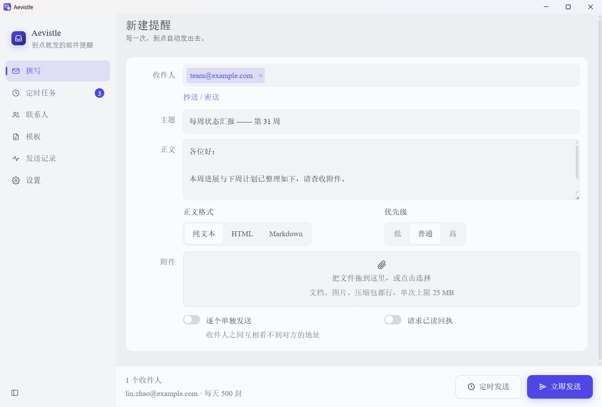
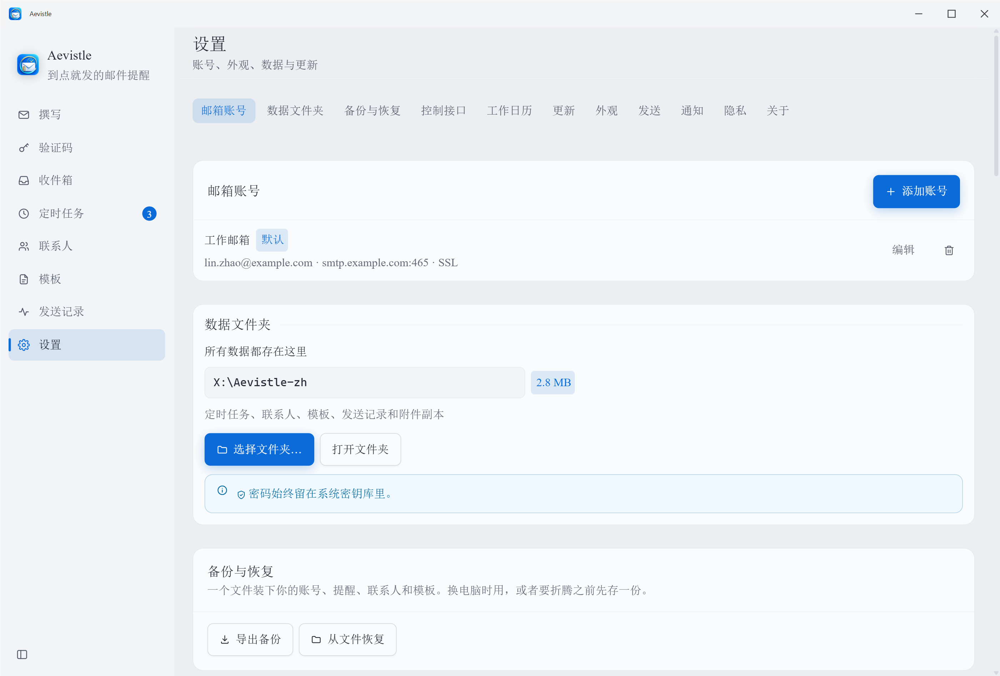

<div align="center">


# Aevistle

**真的会准时到的定时邮件提醒。**

写好一封邮件——可以带文件、图片、压缩包——Aevistle 负责按时发出去，窗口关着
也照发。发一次、每个工作日 09:00、每月 1 号，或者你自己写的任意 cron 表达式
都行。它认得你的法定节假日，周一的周报不会发到一个没人上班的周一去。
Windows 和安卓是同一个应用，不用注册账号，没有服务器，不收集任何数据。
两台设备靠你自己的局域网保持同步——中间不经过任何云。

*每周五的周报。每月 1 号的账单。凌晨零点的生日祝福，那会儿你在睡觉。*

[](https://github.com/Aevorine/Aevistle/releases/latest)
[](https://github.com/Aevorine/Aevistle/actions/workflows/ci.yml)
[](../LICENSE)
[](https://github.com/Aevorine/Aevistle/releases/latest)
[](https://github.com/Aevorine/Aevistle/releases/latest)
[](#language)

### [⬇ 下载](https://github.com/Aevorine/Aevistle/releases/latest) · [它能做什么](#它能做什么) · [隐私](#隐私) · [安全](#安全)

[English](../README.md) ·
**简体中文** ·
[Français](README.fr.md) ·
[Español](README.es.md) ·
[Русский](README.ru.md) ·
[العربية](README.ar.md)

</div>

---

<div align="center">

</div>

---

## 为什么会有这个东西

哪个邮件客户端都能发邮件，但几乎没有哪个能向你保证：下周二早上 07:00，
带着正确的附件，把这封信发出去——不管你有没有想起来，也不管应用开着没开着。

Aevistle 首先要做到的就是这个承诺。不用注册账号——它连的是你本来就有的
SMTP 服务器（Gmail、Outlook、QQ 邮箱、163、公司自建的服务器），然后把信发出去。
收信功能也有，但默认不会来烦你，你不主动打开它就当它不存在：给某个账号配上
IMAP 服务器，Aevistle 就会同步出一个统一收件箱，自动把验证码和登录链接挑出来，
其余邮件一概不动。

**大家都拿它来** 每周五 17:00 发周报 · 作业截止前一晚提醒全班 · 每月 1 号寄账单 · 半夜十二点自动送出生日祝福 · 每 30 天催一次房租 · 把跟进邮件排到早上而不是凌晨两点送达 · 验证码一到就能直接拿到，不用来回切换应用。

**这些情况可能不适合你**：想要一个功能齐全的邮件客户端——不做文件夹管理、不支持推送式 IDLE 同步、不支持服务器端删除，这些都是故意不做的——需要带追踪像素和打开率的营销工具，或者希望设备关机后还有人替你继续发。Aevistle 用**你自己的**机器、**你自己的**邮箱收发信——这正是它不需要注册、也不收集任何东西的原因。

## 隐私

Aevistle 没有服务器。不用注册账号，不采集任何统计数据，不上报崩溃信息。

会离开你设备的东西是一份固定的短清单：**连接你自己的邮件服务商的 SMTP 连接**；
**同样是你自己的服务商的 IMAP 连接**，仅限你打开了收信的账号；**收到的邮件里的
远程图片**，仅在你逐张点了「加载」时；**检查更新**，向 `api.github.com` 问一句
最新版本是多少，你没关掉的话；以及**某一年的法定节假日表**，仅在你点「联网查询」时。
后两个都按**主机加确切路径**做白名单，并且由受信任的进程发出，而不是由渲染邮件的
那一部分发出——那一部分完全没有出网能力。

配对两台设备不会往这份清单里加东西：它们在你自己的网络里直接对话，
中间没有云，也没有中转服务器。

> 关掉更新检查之后，这份清单里剩下的每一个请求，都是你按了按钮才发生的。

每样东西存在哪、搬动数据文件夹会发生什么、以及**故意**不跟着搬的那两样东西
→ **[PRIVACY.md](PRIVACY.md)**。

## 它能做什么

| | |
|---|---|
| ⏰ **关掉窗口照样发** | Windows 上留一个托盘进程，安卓用精确闹钟 + WorkManager。关窗口不等于取消提醒。[→](FEATURES.md#fires-when-closed) |
| 🔁 **真正的重复规则** | 一次、每 N 分钟、每天、每周、每月、每年，以及完整的 5 段 cron 表达式。[→](FEATURES.md#real-recurrence) |
| 📎 **等得起的附件** | 定时的那一刻就给文件留了快照，之后移动或改名原文件，都不会让这封信悄悄发不出去。[→](FEATURES.md#attachment-snapshots) |
| 🎌 **工作日历** | 法定节假日、你自己定义的周末、调休上班日、六个国家的一键预设，`.ics` 能进能出。每条提醒各自决定跟不跟。[→](FEATURES.md#working-days-you-define) |
| 🌐 **送达时段** | 提醒落进**收件人**的白天而不是你的；几个时段凑不到一起时它会说出来，但绝不会扣着不发。[→](FEATURES.md#delivery-windows) |
| 📆 **月历本身就是计划表** | 拖动改期、点击打开、按当天忙不忙上色，还有收件人标签、正文预览和送达状态。[→](FEATURES.md#the-month-grid-is-the-schedule) |
| 📥 **可选的收件功能** | IMAP，多账号汇成一个收件箱，远程图片默认拦截，验证码单独放一个页面。[→](FEATURES.md#optional-inbox) |
| 🔤 **模板变量** | 按收件人填入联系人字段，外加 `{{nextWorkday}}` 这类日历变量，发送时才解析，副本不带 Cc/Bcc。[→](FEATURES.md#merge-variables) |
| 🔐 **密码不乱跑** | 由操作系统加密：Windows 用 DPAPI，安卓用硬件级 Keystore。绝不写进设置文件，导出配置里也没有。[→](FEATURES.md#passwords-stay-put) |
| 🎨 **七套视觉风格** | 每套都有真正的亮色版和暗色版，其中一套是通篇 WCAG AAA，不是「差不多」。[→](FEATURES.md#seven-visual-styles) |

这样的条目一共三十六条，每一条都写了它为什么是这样 →
**[FEATURES.md](FEATURES.md)**

## 0.1.14 新增

- **🔗 只走局域网的双设备配对。** 在另一台设备上扫一个二维码：ECDH P-256 +
  AES-GCM，一次性令牌两分钟过期，全程没有云，也没有任何中转服务器。同步范围
  由你勾选——账号、日程、联系人、模板、外观——配对过的设备在同一个页面里管理。
  两台设备互相够不着时，改用一个 PIN 加密的文件来交换。
- **📅 日历知道邮件的事了。** 每天的收件人标签和邮件条数、密度热力图、不离开
  月历就能看正文预览、拖动改期时**当场**显示收件人那边的本地时间、发送撞上
  节假日时给出改期建议、对整个重复系列批量操作、按账号或收件人筛选、送达状态
  标记，以及一个本地的 `.ics` 订阅地址（订阅的是工作日历）。
- **🎨 新增视觉风格 runecircuit。** 中国古典水墨遇上赛博朋克霓虹，有真正的
  日间与夜间两种形态、一个氛围强度调节，以及一个双轴强调色选择器。它是第七套
  风格，也是第一套有「天气」的。
- **🌾 二十四节气，算出来的，不是查表来的。** 用的是 Meeus 的太阳位置算法而不是
  内置表，所以不存在「数据到某一年就没了」。它只用来给日历上色，绝不碰发送时间。

详细写法见 **[FEATURES.md](FEATURES.md)**；再往前的改动在仓库根目录的
`release-notes-0.1.*.md` 里。

## 下载

到 **[Releases](https://github.com/Aevorine/Aevistle/releases/latest)** 拿最新版本。

| 平台 | 文件 | 说明 |
|---|---|---|
| Windows 10/11 (x64) | `Aevistle-<version>-win-x64-setup.exe` | 安装版，会建开始菜单和桌面快捷方式 |
| Windows 10/11 (x64) | `Aevistle-<version>-win-x64-portable.exe` | 单文件免安装，可以放 U 盘里直接跑 |
| Android 7.0+ | `Aevistle-<version>.apk` | 手机和平板都能装。先在浏览器或文件管理器里允许「安装未知应用」。 |

`<version>` 就是[最新发布页](https://github.com/Aevorine/Aevistle/releases/latest)上写的那个版本号，
顶部那个徽章读的也是同一处。这里故意不写死，免得过一阵就对不上了。

> **校验下载的文件。** 每个 Release 都会发布 `SHA256SUMS.txt`、它的分离签名
> `SHA256SUMS.txt.asc`，以及签名用的公钥：
>
> ```bash
> gpg --import aevistle-public-key.asc
> gpg --verify SHA256SUMS.txt.asc SHA256SUMS.txt
> sha256sum -c SHA256SUMS.txt
> ```
>
> 只对校验和能证明文件传输完整；对签名才能证明它出自本项目的密钥。
> 指纹写在 [SECURITY.md](../SECURITY.md)。

> Windows SmartScreen 会提示「未知发布者」。没有购买代码签名证书的软件就是这个样子，
> 选 **更多信息 → 仍要运行**；不放心的话，先对一下 Release 页面上的 SHA-256 校验值。

## 上手四步

1. **添加邮箱**：设置 → 添加账号。选服务商，服务器地址、端口、加密方式会自动填好。
2. **拿一个授权码**：Gmail、Outlook、Yahoo、iCloud、QQ 邮箱、163 都不接受第三方应用用
   登录密码，必须用授权码 / 应用专用密码。账号对话框里直接给了申请页面的链接。
3. **测试连接**：一个按钮。只做认证不发信，问题现在就暴露，而不是凌晨三点。
4. **写提醒内容**，挂上附件，点**定时发送**。

<div align="center">

</div>

想让关掉窗口后照样按时发送：Windows 上保持「最小化到托盘」开着；
安卓上系统申请**精确闹钟**和**通知**权限时点允许。

## 安全

威胁模型、具体做了哪些加固、以及怎么报告漏洞，都在
**[SECURITY.md](../SECURITY.md)**。

简单说：渲染进程完全没有 Node 权限，开启了上下文隔离和严格 CSP；
任何要写进邮件头的字符串，只要含有换行符就直接拒绝（开放中继就是这么来的）；
TLS 证书默认强制校验，除非你自己在某个账号上明确关掉；
收到的邮件的 HTML 会先在主进程里按严格白名单做净化，才交给渲染进程，
并且在一个沙箱 iframe 里渲染，不管什么情况都不允许执行脚本；
安卓的闹钟接收器没有导出，别的应用没法让 Aevistle 替它发邮件。

这些你都可以自己验：`npm run audit:self`——**21 项检查**，大白话输出，
有问题就返回退出码 1。

## 从源码构建

**环境要求**——Node.js 20+；要打安卓包还需要 JDK 17+ 和 Android SDK
（platform 36、build-tools 35 以上）。`npm run build:android` 会自动找出
已安装但没进 PATH 的 JDK 和 SDK，所以不设 `JAVA_HOME` 也行。

```bash
git clone https://github.com/Aevorine/Aevistle.git
cd Aevistle
npm install
```

| 想干什么 | 命令 |
|---|---|
| 在浏览器里跑（不能发信，其余全是真的） | `npm run dev` |
| 类型检查 | `npm run typecheck` |
| 安全自检（21 项） | `npm run audit:self` |
| CI 跑的全套（42 项） | `npm run check` |
| 跑桌面版 | `npm start` |
| 打 Windows 安装包 | `npm run dist:win` |
| 打安卓 APK | `npm run build:android` |

安卓正式签名读 `~/.aevistle/keystore.properties` 或 `AEVISTLE_KEYSTORE*`
环境变量。两者都没有时会退回 debug 签名，**依然能装上**，只是不是发布用的那把钥匙。

## 它是怎么搭起来的

一套 React + TypeScript 界面，两个原生外壳。

```
src/core/        与平台无关：领域模型、重复规则引擎、校验、SMTP 服务商预设
                 —— 不碰 DOM、不碰 Node、不碰安卓
src/             React 界面（六语言、七套视觉风格，每套都有真正的亮色与暗色）
    ↓ PlatformBridge —— 界面与操作系统之间唯一的接缝
electron/        Windows：nodemailer + imapflow、DPAPI 密码存储、托盘、
                 混合轮询/精确调度器、收信 HTML 净化
android/         安卓：JavaMail（收发信）、Keystore、AlarmManager + WorkManager
```

重复规则引擎**只**用 TypeScript 写。它预先算出一串绝对时间戳，
各平台的调度器只需要回答「到 T 时刻叫醒我」——于是所有日历规则
（闰年、小月、夏令时、跳过周末）只存在一份、只用一种语言写，
而且不用开模拟器就能测。

更多细节见 **[ARCHITECTURE.md](ARCHITECTURE.md)**。

## 路线图

不是承诺，只是最有可能接下来做的事。

- [ ] Gmail 与 Microsoft 365 的 OAuth 2.0，从此不用申请授权码
- [ ] 富文本编辑器。内嵌图片已经能用了，但正文框本身还是纯文本 + Markdown
- [ ] macOS 与 Linux 桌面版（代码已经能编到这两个平台）
- [ ] 把 `FEATURES.md` 翻成另外五种语言
- [ ] iOS

缺什么功能？[提个 issue](https://github.com/Aevorine/Aevistle/issues)——
功能建议是真心欢迎的。

## 参与开发

欢迎提 PR。代码结构和「什么样的改动算好改动」写在
**[CONTRIBUTING.md](../CONTRIBUTING.md)**，相处方式写在
**[CODE_OF_CONDUCT.md](../CODE_OF_CONDUCT.md)**。
加第七种语言只需要改一个文件，也不需要任何构建工具——
类型系统会直接告诉你还缺哪几条字符串。

报 bug 和提需求都有[模板](https://github.com/Aevorine/Aevistle/issues/new/choose)；
每个 PR 都会自动跑一遍你本地跑的那个 `npm run check`。

## Language

| | | |
|---|---|---|
| [English](../README.md) | [简体中文](README.zh-CN.md) | [Français](README.fr.md) |
| [Español](README.es.md) | [Русский](README.ru.md) | [العربية](README.ar.md) |

## 许可

[MIT](../LICENSE) © Aevistle contributors
